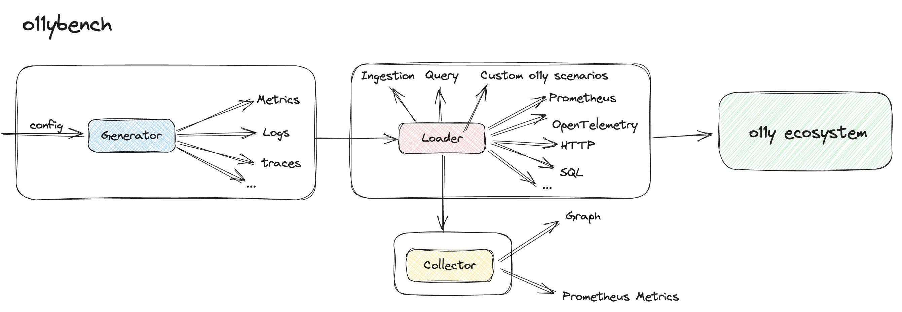

# o11ybench

`o11ybench` is a powerful tool for benchmarking observability ecosystems.

It will move very fast and break things, so please be careful to use it.

The docs are not ready yet, so please refer to the code and examples.

## Architecture

The following diagram shows the future architecture of `o11ybench`.

<div align="center">
  
</div>

## Features

- Support to generate logs by **ANY** format with the config file

- Support to generate logs with popular log format, such as apache common log, nginx access log, etc

## Usage

### Compile

```console
make build
```

The `o11ybench` binary will be built in the `bin` directory.

### Generate logs

```console
o11ybench logs generate -c config.yaml
```

You can find more config examples in the `configs` directory.

## Roadmap

- [ ] Support to generate more popular log format
- [ ] Support more fake data generator
- [ ] Add logs benchmark
- [ ] Add otel traces benchmark
- [ ] Support prometheus metrics output(prometheus-benchmark)
- [ ] Be compatible with TSBS
- [ ] Output results in svg format
- [ ] Expose Prometheus metrics
- [ ] Flexible to define hybrid workloads benchmark by config file
